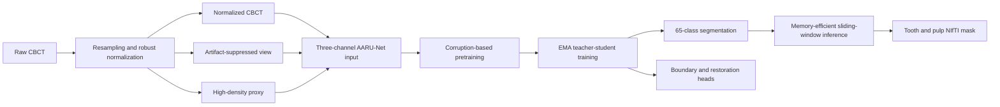

# AARU: Artifact-Aware Learning for Tooth and Pulp Segmentation in CBCT

[](https://www.python.org/)
[](https://pytorch.org/)
[](https://github.com/Myselffe/AARU_STS-2026-challenge-Task1)

Official source code for our STS 2026 Challenge Task 1 method for semi-supervised 3-D tooth and pulp segmentation in cone-beam computed tomography (CBCT).

ArtifactAware-SSL combines artifact-aware inputs, corruption-based self-supervised pretraining, and EMA teacher-student learning. The challenge submission described in our paper achieved a composite score of **0.474** and ranked **8th** in STS 2026 Task 1.

> **Research-use notice:** this repository is intended for research and challenge reproduction. It is not a medical device and must not be used for clinical diagnosis or treatment planning.

## Paper and implementation status

The accompanying paper is available at [Artifact-Aware Learning for Tooth and Pulp Segmentation in CBCT](Artifact_Aware_Learning_for_Tooth_and_Pulp_Segmentation_in_CBCT.pdf).

The paper documents the submitted ArtifactAware-SSL system. The current default configuration in this repository is a continued research implementation rather than a byte-identical archive of the submitted run. In particular:

| Component | Paper submission | Current repository default |
|---|---|---|
| Network input | normalized CBCT + high-density proxy | raw normalized CBCT + artifact-suppressed view + proxy |
| Backbone | five-level residual 3-D U-Net | residual 3-D U-Net with lightweight axial context |
| Supervised objectives | Dice, cross-entropy, deep supervision, restoration | adds foreground, boundary, topology, and automatic class-balancing losses |
| Unlabeled supervision | fixed confidence threshold | class-aware thresholds, entropy filtering, and foreground-aware weighting |
| Sliding-window fusion | patch-center selection | patch-center and prediction-confidence selection |

The reported score and rank refer only to the submitted system described in the paper. No additional challenge score is claimed for the extended default configuration.

## Method overview



The implementation contains the following main components:

- **Artifact-aware preprocessing:** case-wise percentile clipping, foreground-aware Z-score normalization, automatic target spacing, and a conservative high-density proxy.
- **Three-channel input:** the normalized CBCT, a locally suppressed artifact view, and the proxy mask retain the original anatomy while exposing potential artifact regions.
- **AARU-Net:** a five-level residual 3-D U-Net with GroupNorm, deep supervision, optional axial context, a boundary head, and a bounded residual restoration head.
- **Self-supervised pretraining:** synthetic metal-like corruption, cube masking, and low-resolution degradation provide a reconstruction task for labeled and unlabeled scans without using voxel labels.
- **Structure-aware supervision:** multiclass Dice and cross-entropy are augmented by foreground Dice, boundary supervision, soft clDice for configured tubular classes, and inverse-frequency class weights.
- **Semi-supervised learning:** an EMA teacher supplies entropy- and confidence-filtered soft targets and pseudo-labels to a strongly perturbed student.
- **Artifact consistency:** predictions are encouraged to remain stable inside synthetically corrupted regions.
- **Low-memory inference:** overlapping patches are fused without allocating a dense `classes x depth x height x width` probability volume.

## Repository layout

```text
.
|-- cbct_ssl/                 # Model, data, losses, training, inference, and metrics
|-- configs/default.yaml      # Default experiment configuration
|-- scripts/
|   |-- prepare_data.py       # Discover, resample, normalize, and cache the dataset
|   |-- pretrain.py           # Corruption-based self-supervised pretraining
|   |-- train.py              # Supervised and semi-supervised training
|   |-- predict.py            # Whole-volume inference
|   |-- evaluate.py           # Lightweight local evaluation
|   |-- evaluate_official.py  # Challenge-style weighted evaluation
|   `-- prepare_submit.py     # Prediction validation and ZIP packaging
|-- tests/test_core.py        # Unit tests for core numerical behavior
|-- requirements.txt
`-- Artifact_Aware_Learning_for_Tooth_and_Pulp_Segmentation_in_CBCT.pdf
```

Generated data, checkpoints, predictions, logs, and challenge images are intentionally excluded from version control.

## Requirements

- Python 3.10 or newer
- PyTorch 2.x
- A CUDA-capable GPU is strongly recommended for training
- Sufficient storage for resampled CBCT caches

PyTorch is intentionally omitted from `requirements.txt` so that it does not replace a wheel matched to your CUDA runtime.

```bash
git clone https://github.com/Myselffe/AARU_STS-2026-challenge-Task1.git
cd AARU_STS-2026-challenge-Task1

python -m venv .venv
source .venv/bin/activate          # Windows PowerShell: .venv\Scripts\Activate.ps1

# Install PyTorch first by following https://pytorch.org/get-started/locally/
pip install -r requirements.txt
```

Run a model-level smoke test and the unit tests after installation:

```bash
python scripts/smoke_test.py
pytest tests
```

`scripts/smoke_data_pipeline.py` additionally creates a temporary synthetic NIfTI dataset and exercises preparation, pretraining, training, and inference end to end.

## Dataset layout

The STS 2026 data are not redistributed in this repository. Arrange the challenge data as follows:

```text
Dataset/
|-- Train-Labeled/
|   |-- images/
|   |   `-- <case_id>.nii.gz
|   `-- labels/
|       `-- <case_id>.nii.gz
|-- Train-Unlabeled/
|   `-- <case_id>.nii.gz
`-- Validation/
    `-- images/
        `-- <case_id>.nii.gz
```

Image and label basenames must match for every labeled case. Both `.nii` and `.nii.gz` files are supported.

Set `data.dataset_root` and `data.work_dir` in `configs/default.yaml`, or override them from the command line:

```bash
python scripts/prepare_data.py \
  --set data.dataset_root=/path/to/Dataset \
  --set data.work_dir=./work
```

Preparation automatically:

1. validates image-label pairing;
2. constructs contiguous training-label mappings;
3. estimates the target spacing from labeled images when `target_spacing: auto`;
4. resamples images and masks using cubic and nearest-neighbor interpolation, respectively;
5. stores normalized images, proxy masks, geometry, label mappings, and a reproducible train/validation split under `work/`.

## Training

### 1. Self-supervised pretraining

```bash
python scripts/pretrain.py \
  --config configs/default.yaml \
  --run-name aaru_pretrain
```

The best pretraining checkpoint is written to:

```text
work/pretrain/aaru_pretrain/pretrain_best.pt
```

### 2. Semi-supervised segmentation

```bash
python scripts/train.py \
  --config configs/default.yaml \
  --run-name aaru_task1 \
  --pretrained work/pretrain/aaru_pretrain/pretrain_best.pt
```

Training checkpoints and metrics are saved under `work/runs/aaru_task1/`. Resume an interrupted run with:

```bash
python scripts/train.py \
  --config configs/default.yaml \
  --run-name aaru_task1 \
  --resume work/runs/aaru_task1/checkpoint_last.pt
```

Most configuration values can be overridden without editing YAML. Nested keys use dot notation:

```bash
python scripts/train.py \
  --set train.steps=1000 \
  --set train.patch_size='[80,160,160]' \
  --set semi_supervised.enabled=false
```

## Inference

The inference loader prefers the EMA weights stored in the checkpoint and falls back to student weights for older checkpoints.

```bash
python scripts/predict.py \
  --checkpoint work/runs/aaru_task1/checkpoint_best.pt \
  --input-dir /path/to/Dataset/Validation/images \
  --output-dir work/predictions
```

For the faster challenge submission path, which uses 25% patch overlap and disables TTA and restoration output:

```bash
python scripts/predict.py \
  --checkpoint work/runs/aaru_task1/checkpoint_best.pt \
  --input-dir /path/to/Dataset/Validation/images \
  --output-dir work/predictions \
  --submission-fast
```

Useful options include:

- `--patch-size D H W` to reduce per-patch GPU memory;
- `--overlap` to control the speed-accuracy trade-off;
- `--tta-axes` for spatial flip test-time augmentation when label semantics permit it;
- `--ignore-prepared-cache` to preprocess the original NIfTI files again;
- `--write-restored` to export the auxiliary artifact-suppressed CBCT for research quality control. This output is not a clinically validated metal-artifact-reduction result.

Predictions preserve the original NIfTI geometry and are mapped back to the dataset's raw label IDs.

## Evaluation and submission packaging

Lightweight local Dice, mIoU, and NSD evaluation:

```bash
python scripts/evaluate.py \
  --prediction-dir work/predictions \
  --label-dir /path/to/labels \
  --output-json work/local_metrics.json
```

Challenge-style evaluation expects a Codabench layout:

```text
evaluation_input/
|-- ref/   # reference masks
`-- res/   # prediction masks
```

```bash
python scripts/evaluate_official.py evaluation_input work/official_evaluation
```

The challenge-style evaluator reports label-wise and image-wise Dice, mIoU, NSD, and identification accuracy, with filenames containing `_with-artifacts` receiving twice the aggregation weight.

Validate and package the 20 public validation predictions:

```bash
python scripts/prepare_submit.py \
  --masks work/predictions \
  --expected-count 20 \
  --output work/task1_submission.zip
```

## Default configuration highlights

| Setting | Default |
|---|---:|
| Output classes | inferred from labeled data; 65 for STS 2026 Task 1 |
| Encoder widths | 24, 48, 96, 160, 224 |
| Training patch | 96 x 192 x 192 |
| Batch size | 1 |
| Pretraining steps | 12,000 |
| Segmentation steps | 60,000 |
| Optimizer | AdamW |
| Initial learning rate | 2e-4 |
| EMA decay | 0.995 |
| AMP dtype | bfloat16 |
| Full-volume validation interval | 5,000 steps |
| Inference overlap | 0.5 (0.25 with `--submission-fast`) |

Review `configs/default.yaml` before starting a full run. In particular, verify `loss.tubular_raw_labels` and `inference.preserve_raw_labels` against the label semantics of your dataset.

## Reproducibility notes

- Checkpoints store the resolved training configuration and number of classes.
- Data preparation records label mappings, target spacing, case paths, and the internal split under `work/`.
- Random seeds are configured, but exact bitwise reproducibility is not guaranteed across CUDA, cuDNN, PyTorch, and hardware versions.
- Challenge data, trained weights, and patient-derived outputs are not included.
- The optional restoration head learns from controlled corruptions of observed scans; it is not supervised by paired artifact-free CBCT.

## Citation

If you use this code, please cite:

```bibtex
@misc{zeng2026artifactaware,
  title  = {Artifact-Aware Learning for Tooth and Pulp Segmentation in CBCT},
  author = {Zeng, Wei and Zhou, Tiansheng},
  year   = {2026},
  note   = {STS 2026 Challenge Task 1 paper}
}
```

## Acknowledgements

We thank the MMDental data owners, the MICCAI STS 2026 organizers, and Codabench for providing the benchmark data and evaluation platform. The framework also builds on ideas from 3-D U-Net, Mean Teacher, weak-to-strong consistency, and disruptive autoencoding; full references are listed in the accompanying paper.

## Contact

- Wei Zeng: `zeng_wei@hdu.edu.cn`
- Tiansheng Zhou: `tiansheng_zhou@hdu.edu.cn`

School of Communication Engineering, Hangzhou Dianzi University, Hangzhou, China.
